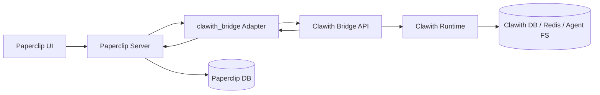

# Paperclip × Clawith 短期 PoC 需求与方案文档

> 版本：v1.0  
> 目标：在短期内验证 Paperclip 调用 Clawith 数字员工能力的可行性  
> 推荐路径：**Clawith 独立服务 + Paperclip `clawith_bridge` 适配器**

---

## 1. 结论

短期 PoC 不建议把 Clawith 运行时直接移植到 Paperclip。推荐采用桥接方案：

```text
Paperclip 负责：组织、任务、issue、审批、预算、审计、agent 调度入口
Clawith 负责：数字员工 persona、memory、workspace、focus、reflection、runtime 执行
Bridge 负责：鉴权、ID 映射、幂等、调用、结果回流、状态查询
```

一期目标只验证核心链路：

```text
Paperclip issue/run -> clawith_bridge adapter -> Clawith Bridge API -> Clawith agent runtime -> 执行结果回流 Paperclip
```

---

## 2. 背景

项目地址：

- Paperclip: https://github.com/paperclipai/paperclip
- Clawith: https://github.com/dataelement/Clawith

两个系统定位不同：

| 系统 | 定位 | 关键能力 |
|---|---|---|
| Paperclip | 多 agent 控制平面 | 公司、agent、issue、目标、审批、预算、插件、adapter、审计 |
| Clawith | 数字员工运行时 | persona、memory、workspace、focus、trigger、reflection、MCP、渠道接入 |

PoC 应避免重写双方核心架构，优先验证二者组合后的业务闭环。

---

## 3. 目标与非目标

### 3.1 目标

1. Paperclip 可配置一个使用 `clawith_bridge` 的 agent。
2. Paperclip issue/run 可唤醒 Clawith 数字员工。
3. Clawith 可基于自身 persona、memory、workspace 执行任务。
4. Clawith 执行结果可回写 Paperclip run log 或 issue comment。
5. 支持基础状态查询、鉴权、幂等、超时与错误隔离。
6. 支持一键回滚到 Paperclip 原有 adapter。

### 3.2 非目标

一期不做：

- 不移植 Clawith runtime 到 Paperclip。
- 不嵌入完整 Clawith UI。
- 不接 Plaza、MCP marketplace、IM 渠道、多 agent A2A 深度协作。
- 不改造 Paperclip 主数据模型。
- 不复用 Paperclip 内置 `openclaw_gateway` 作为主桥接方案。
- 不把 Paperclip 内置 HTTP adapter 作为最终方案。

---

## 4. 用户角色与核心场景

| 角色 | 诉求 |
|---|---|
| 管理员 | 在 Paperclip 中配置 Clawith Bridge 地址、密钥和 agent 映射 |
| 任务发起人 | 在 Paperclip 创建 issue，让 Clawith 数字员工执行 |
| 数字员工 | 在 Clawith 中保留自身人格、记忆、工作区并执行任务 |
| 运维/开发 | 通过 run id/request id 排查链路问题 |

核心场景：

1. 管理员在 Paperclip 创建 agent，adapter 选择 `clawith_bridge`。
2. Paperclip 触发 issue/run。
3. Adapter 携带 issue、goal、run id 调用 Clawith Bridge API。
4. Bridge 根据映射找到或创建 Clawith tenant/agent/session。
5. Clawith agent 执行任务。
6. Bridge 返回结果。
7. Paperclip 写入 run log 或 issue comment。

---

## 5. 总体架构



职责边界：

| 模块 | 职责 |
|---|---|
| Paperclip | agent 配置、issue/run、权限入口、结果展示、审计 |
| `clawith_bridge` adapter | 组装请求、签发短时 token、调用 Bridge API、标准化响应 |
| Clawith Bridge API | 鉴权、映射、幂等、调用 runtime、状态查询 |
| Clawith Runtime | persona/memory/workspace 读取、agent 执行、会话保存 |

---

## 6. 功能需求

### 6.1 Paperclip 侧

| 编号 | 需求 | 优先级 |
|---|---|---|
| P1 | 新增 `clawith_bridge` adapter | P0 |
| P2 | adapter 支持配置 `baseUrl`、`bridgeSecret`、`timeoutSec` | P0 |
| P3 | 执行时传递 `company_id`、`agent_id`、`issue_id`、`run_id`、message | P0 |
| P4 | 接收 Clawith 结果并写入 run log 或 issue comment | P0 |
| P5 | 展示 Clawith agent 基础状态 | P1 |
| P6 | 展示 focus/reflection 只读摘要 | P1 |
| P7 | 支持 feature flag 快速关闭桥接能力 | P0 |

### 6.2 Clawith 侧

| 编号 | 需求 | 优先级 |
|---|---|---|
| C1 | 新增 `/api/bridge/health` | P0 |
| C2 | 新增 Paperclip 与 Clawith 的 ID 映射表 | P0 |
| C3 | 新增 `/api/bridge/agents/sync` | P0 |
| C4 | 新增 `/api/bridge/agents/{paperclipAgentId}/wake` | P0 |
| C5 | 支持根据 issue 创建或复用 Clawith session | P0 |
| C6 | 调用 Clawith 原生 agent runtime 执行任务 | P0 |
| C7 | 返回标准化执行结果 | P0 |
| C8 | 提供 state/focus/reflections 只读 API | P1 |
| C9 | 支持幂等、超时和错误状态 | P0 |

### 6.3 Bridge 横切能力

| 编号 | 需求 | 优先级 |
|---|---|---|
| B1 | 使用短时 JWT 或 HMAC 进行服务间认证 | P0 |
| B2 | 所有请求必须带 `X-Request-Id` 和 `X-Idempotency-Key` | P0 |
| B3 | 同一 idempotency key 不得重复执行 | P0 |
| B4 | 日志中可通过 `run_id` 串联 Paperclip 与 Clawith | P0 |
| B5 | Clawith 不可用时 Paperclip run 标记失败但主服务不崩溃 | P0 |

---

## 7. Bridge API 设计

### 7.1 API 列表

| 方法 | 路径 | 说明 | 一期 |
|---|---|---|---|
| GET | `/api/bridge/health` | 健康检查 | 是 |
| POST | `/api/bridge/agents/sync` | 同步/创建映射 | 是 |
| POST | `/api/bridge/agents/{paperclipAgentId}/wake` | 唤醒数字员工 | 是 |
| GET | `/api/bridge/runs/{paperclipRunId}` | 查询执行状态 | 是 |
| GET | `/api/bridge/agents/{paperclipAgentId}/state` | 查询 agent 状态 | 是 |
| GET | `/api/bridge/agents/{paperclipAgentId}/focus` | 查询 focus 摘要 | 可选 |
| GET | `/api/bridge/agents/{paperclipAgentId}/reflections` | 查询 reflection 摘要 | 可选 |

### 7.2 Wake 请求

```json
{
  "company_id": "paperclip-company-uuid",
  "agent_id": "paperclip-agent-uuid",
  "issue_id": "paperclip-issue-uuid",
  "run_id": "paperclip-run-uuid",
  "idempotency_key": "paperclip-run-uuid:wake:v1",
  "message": "请处理这个 issue 并返回结果",
  "goal": {
    "id": "paperclip-goal-uuid",
    "title": "目标标题"
  },
  "issue": {
    "title": "issue 标题",
    "description": "issue 描述",
    "comments": []
  },
  "context": {
    "source": "paperclip",
    "mode": "poc"
  }
}
```

### 7.3 Wake 同步响应

```json
{
  "status": "completed",
  "paperclip_run_id": "paperclip-run-uuid",
  "clawith_agent_id": "clawith-agent-uuid",
  "clawith_session_id": "clawith-session-uuid",
  "summary": "执行摘要",
  "message": "回写到 Paperclip 的正文",
  "artifacts": [],
  "usage": {
    "model": "provider/model",
    "input_tokens": 0,
    "output_tokens": 0
  }
}
```

### 7.4 Wake 异步响应

```json
{
  "status": "accepted",
  "paperclip_run_id": "paperclip-run-uuid",
  "clawith_session_id": "clawith-session-uuid",
  "poll_url": "/api/bridge/runs/paperclip-run-uuid"
}
```

### 7.5 错误响应

```json
{
  "status": "failed",
  "error_code": "CLAWITH_RUNTIME_TIMEOUT",
  "message": "Clawith runtime execution timed out",
  "retryable": true
}
```

---

## 8. 数据模型

Clawith 侧新增桥接映射表，避免污染原生 agent/session 模型。

```text
bridge_mappings
```

| 字段 | 说明 |
|---|---|
| `id` | Bridge mapping UUID |
| `paperclip_company_id` | Paperclip company UUID |
| `paperclip_agent_id` | Paperclip agent UUID |
| `paperclip_issue_id` | Paperclip issue UUID，可为空 |
| `paperclip_run_id` | 最近一次 Paperclip run UUID |
| `clawith_tenant_id` | Clawith tenant UUID |
| `clawith_agent_id` | Clawith agent UUID |
| `clawith_session_id` | Clawith session UUID，可为空 |
| `idempotency_key` | 最近一次幂等键 |
| `status` | `active` / `disabled` / `failed` |
| `metadata` | JSON 扩展字段 |
| `created_at` | 创建时间 |
| `updated_at` | 更新时间 |

规则：

1. 跨系统路由只使用 UUID，不使用名称匹配。
2. 一个 Paperclip company 映射一个 Clawith tenant。
3. 一个 Paperclip agent 映射一个 Clawith agent。
4. 一个 Paperclip issue 可映射一个 Clawith session。
5. 同一个 `idempotency_key` 必须返回同一执行结果。

---

## 9. 鉴权与安全

### 9.1 请求头

```http
Authorization: Bearer <bridge-jwt>
X-Paperclip-Run-Id: <paperclip-run-id>
X-Idempotency-Key: <company-id>:<agent-id>:<issue-id>:<run-id>
X-Request-Id: <trace-id>
Content-Type: application/json
```

### 9.2 JWT Claims

```json
{
  "iss": "paperclip",
  "aud": "clawith-bridge",
  "sub": "paperclip-agent-uuid",
  "company_id": "paperclip-company-uuid",
  "agent_id": "paperclip-agent-uuid",
  "issue_id": "paperclip-issue-uuid",
  "run_id": "paperclip-run-uuid",
  "jti": "uuid",
  "iat": 1710000000,
  "exp": 1710000300
}
```

### 9.3 安全要求

| 场景 | 处理 |
|---|---|
| token 缺失或过期 | 401 |
| company/agent 映射不匹配 | 403 |
| 重复 idempotency key | 返回既有结果，不重复执行 |
| Clawith runtime 超时 | 返回 `accepted` 或 `failed`，可查询状态 |
| Bridge secret 泄露 | 支持轮换密钥 |
| 日志 | 不打印完整 token，不打印敏感密钥 |

---

## 10. Paperclip 侧实现方案

建议新增独立 adapter 包：

```text
packages/adapters/clawith-bridge/
  package.json
  src/index.ts
  src/server.ts
  src/config.ts
  src/types.ts
```

核心逻辑：

```text
execute(ctx)
  1. 读取 adapter config
  2. 从 ctx 提取 company、agent、issue、goal、run 信息
  3. 生成 bridge JWT
  4. 生成 idempotency key
  5. POST /api/bridge/agents/{agentId}/wake
  6. 解析 Bridge 响应
  7. 写入 Paperclip run log / issue comment
  8. 返回标准执行结果
```

配置项：

| 字段 | 示例 | 说明 |
|---|---|---|
| `baseUrl` | `http://localhost:8008` | Clawith Bridge 地址 |
| `bridgeSecret` | `***` | JWT/HMAC 签名密钥 |
| `timeoutSec` | `120` | 单次调用超时 |
| `mode` | `sync` / `async` | PoC 可先用 sync |
| `writeBack` | `run_log` / `issue_comment` | 结果回写位置 |

---

## 11. Clawith 侧实现方案

建议新增文件：

```text
backend/app/api/bridge.py
backend/app/schemas/bridge.py
backend/app/models/bridge_mapping.py
backend/app/services/bridge_mapping_service.py
backend/app/services/bridge_runtime_service.py
backend/app/services/bridge_auth_service.py
```

核心流程：

```text
POST /api/bridge/agents/{paperclip_agent_id}/wake
  1. 验证 JWT / HMAC
  2. 校验 company_id、agent_id、run_id
  3. 校验 idempotency key
  4. resolve_or_create tenant mapping
  5. resolve_or_create agent mapping
  6. resolve_or_create issue session
  7. 组装 Clawith runtime context
  8. 调用 Clawith agent runtime
  9. 保存消息与执行记录
  10. 返回 BridgeWakeResponse
```

实现原则：

1. Bridge API 是稳定契约，Paperclip 不直接依赖 Clawith 内部 chat/gateway/triggers API。
2. Clawith 原有 persona、memory、workspace 文件结构保持不变。
3. Trigger、Plaza、MCP、渠道接入不进入一期主链路。
4. 所有跨系统调用都要有 request id、run id、idempotency key。

---

## 12. 部署方案

### 12.1 本地 PoC

```text
Paperclip: localhost:3100
Clawith Backend / Bridge: localhost:8008
Clawith Frontend: localhost:3008
PostgreSQL: 两侧可独立，也可 PoC 阶段分库共实例
Redis: 仅 Clawith 使用
Agent FS: Clawith 本地 volume
```

### 12.2 环境变量

Paperclip：

```env
CLAWITH_BRIDGE_BASE_URL=http://localhost:8008
CLAWITH_BRIDGE_SECRET=dev-secret
CLAWITH_BRIDGE_TIMEOUT_SEC=120
CLAWITH_BRIDGE_ENABLED=true
```

Clawith：

```env
BRIDGE_ENABLED=true
BRIDGE_JWT_ISSUER=paperclip
BRIDGE_JWT_AUDIENCE=clawith-bridge
BRIDGE_SHARED_SECRET=dev-secret
BRIDGE_IDEMPOTENCY_TTL_SEC=86400
```

### 12.3 回滚

回滚方式：

1. Paperclip agent adapter 从 `clawith_bridge` 切回原 adapter。
2. 设置 `CLAWITH_BRIDGE_ENABLED=false`。
3. Clawith Bridge API 下线不影响 Paperclip 主流程。
4. 保留 mapping 表便于后续恢复。

---

## 13. 实施计划

建议周期：10–14 个工作日。

| 阶段 | 时间 | 任务 | 产物 |
|---|---:|---|---|
| 1 | 第 1–2 天 | 锁定版本、跑通两仓库、本地环境 | 可启动环境、版本记录 |
| 2 | 第 3–4 天 | Clawith Bridge skeleton、鉴权、mapping 表 | health/sync 可用 |
| 3 | 第 5–7 天 | 实现 wake、session 绑定、runtime 调用 | curl 可唤醒 Clawith agent |
| 4 | 第 8–10 天 | Paperclip `clawith_bridge` adapter | issue/run 可触发并回写结果 |
| 5 | 第 11–12 天 | 幂等、超时、错误处理、日志串联 | 重试不重复执行 |
| 6 | 第 13–14 天 | 状态查询、demo 脚本、验收文档 | 可演示 PoC |

---

## 14. 验收标准

| 编号 | 验收项 |
|---|---|
| A1 | Paperclip 可创建 `clawith_bridge` agent |
| A2 | Paperclip issue/run 可触发 Clawith Bridge wake |
| A3 | Clawith 可创建或复用 tenant/agent/session 映射 |
| A4 | Clawith 执行时可使用自身 persona/memory/workspace |
| A5 | 执行结果可回写 Paperclip run log 或 issue comment |
| A6 | 同一 idempotency key 重试 3 次不重复执行 |
| A7 | 错误 token 返回 401 |
| A8 | company/agent 映射不匹配返回 403 |
| A9 | Clawith 停止时 Paperclip 仅标记该 run failed |
| A10 | 关闭 feature flag 后 Paperclip 原有 agent 流程正常 |
| A11 | 日志可通过 `X-Request-Id` / `run_id` 串联 |

---

## 15. 测试脚本示例

```bash
#!/usr/bin/env bash
set -euo pipefail

CLAWITH_BRIDGE_URL="${CLAWITH_BRIDGE_URL:-http://localhost:8008}"
BRIDGE_TOKEN="${BRIDGE_TOKEN:-dev-token}"

curl -sS \
  -H "Authorization: Bearer ${BRIDGE_TOKEN}" \
  "${CLAWITH_BRIDGE_URL}/api/bridge/health"

curl -sS -X POST \
  -H "Authorization: Bearer ${BRIDGE_TOKEN}" \
  -H "Content-Type: application/json" \
  -H "X-Paperclip-Run-Id: demo-run-001" \
  -H "X-Idempotency-Key: demo-company:demo-agent:demo-issue:demo-run-001" \
  -H "X-Request-Id: demo-request-001" \
  "${CLAWITH_BRIDGE_URL}/api/bridge/agents/demo-agent/wake" \
  -d '{
    "company_id": "demo-company",
    "agent_id": "demo-agent",
    "issue_id": "demo-issue",
    "run_id": "demo-run-001",
    "idempotency_key": "demo-company:demo-agent:demo-issue:demo-run-001",
    "message": "请根据该 issue 输出一份执行建议。",
    "issue": {
      "title": "PoC 测试 issue",
      "description": "验证 Paperclip 调用 Clawith 数字员工。",
      "comments": []
    }
  }'
```

---

## 16. 主要风险与应对

| 风险 | 影响 | 应对 |
|---|---|---|
| 双系统 ID 映射错误 | 结果投递错误 | 只用 UUID，禁止 name 匹配 |
| 重试导致重复执行 | 成本和副作用增加 | 强制 idempotency key |
| Clawith runtime 慢 | Paperclip run 阻塞 | 支持 async accepted + poll |
| Clawith 内部 API 变化 | Paperclip 适配器失效 | 只依赖 Bridge API |
| 鉴权密钥泄露 | 越权调用 | 短时 JWT、密钥轮换、不打印 token |
| 范围膨胀 | PoC 延期 | 一期只做 wake/state/result 回流 |

---

## 17. 最终决策

采用以下方案作为短期 PoC 正式方案：

```text
方案：Clawith 独立服务 + Paperclip clawith_bridge adapter
范围：wake + state + result write-back + 幂等 + 鉴权 + 最小状态查询
周期：10–14 个工作日
风险：中
回滚：简单，切换 Paperclip agent adapter 即可
```

后续二期再考虑：

1. Focus/Reflections UI 增强。
2. Trigger 只读到可写。
3. Plaza 摘要接入 Paperclip。
4. MCP 工具发现与 Paperclip 插件体系联动。
5. 多渠道消息 digest 接入 Paperclip activity。

---

## 18. 待确认问题

| 问题 | 建议默认值 |
|---|---|
| 结果写回 Paperclip 的位置 | 一期写 run log，必要时同步 issue comment |
| wake 同步还是异步 | 一期同步优先，超过 120 秒转异步 |
| agent 映射是自动创建还是手工绑定 | PoC 自动创建，生产前增加管理员确认 |
| 两侧数据库是否共实例 | 可共实例，但必须分库/分 schema |
| 是否需要 UI | 一期非必需，run log 可先满足演示 |
