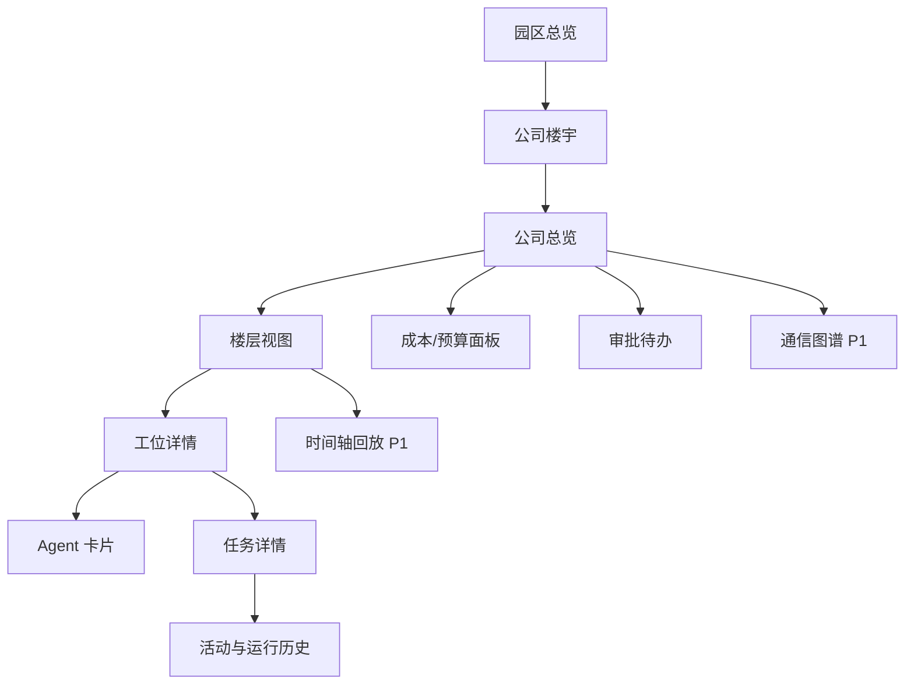
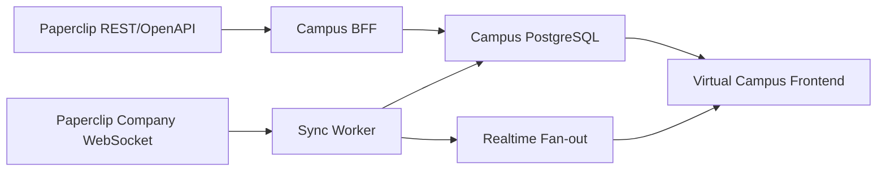
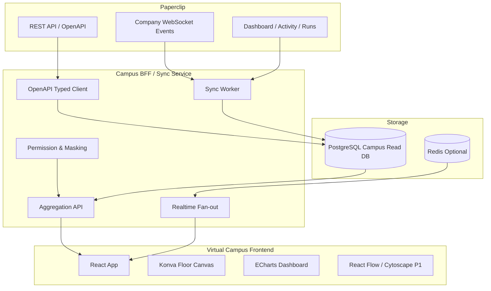

# 虚拟软件园区需求说明与技术方案（精简完备版）

> 基于 `deep-research-report (1).md` 评审与收敛。  
> 版本：v1.0  
> 日期：2026-06-21  
> 适用阶段：MVP 立项、产品评审、前后端技术方案评审、研发拆解。

---

## 1. 评审结论

原报告的主判断成立：**Paperclip 适合作为虚拟软件园区的运营内核，但不应被改造成完整的空间/园区模型系统**。合理边界是：

**Paperclip 控制平面 + Campus 扩展模型 + 实时同步/回放层 + 空间化可视化前端**。

### 1.1 值得保留的判断

| 结论 | 评审意见 |
|---|---|
| Paperclip 是公司/智能体/任务/审批/成本/审计的控制平面 | 成立。它应作为经营事实、任务事实、状态事实的主数据源。 |
| 园区、楼宇、楼层、工位、员工驻留等不是 Paperclip 原生一等实体 | 成立。必须新增 Campus Domain 扩展层。 |
| 不建议硬改 Paperclip 原生页面 | 成立。会破坏升级路径，也容易把空间语义塞进不合适的实体。 |
| MVP 优先采用独立前端 + Campus BFF/Sync Service | 成立。插件运行时仍偏早期，独立集成风险更低。 |
| WebSocket 做增量事件，REST/OpenAPI 做冷启动和详情补全 | 成立。适合当前状态、回放、统计聚合并存的场景。 |
| PostgreSQL 存 Campus 读模型，Redis 作为生产级实时 fan-out 可选项 | 成立。MVP 可先不用 Redis，生产多实例建议引入。 |

### 1.2 原报告需要补强的问题

| 问题 | 影响 | 本版修正 |
|---|---|---|
| 产品范围偏研究型，缺少可验收需求 | 研发难拆解，评审难过 | 增加需求编号、优先级、验收口径。 |
| “员工”定义不够收敛 | AI agent、人类用户、外部 HR 人员会混淆 | MVP 默认只展示 AI agent；真人员工进入 P1 People Directory。 |
| 实时状态口径未定义 | 工位颜色、任务角标、告警规则会不一致 | 拆分为工位占用、员工/Agent 状态、任务状态、告警状态四套语义。 |
| 回放模型未区分事件与快照 | 回放成本、精度、存储策略难确定 | 明确 timeline_event 与 work_state_snapshot 的职责。 |
| 权限和隐私不足以落地 | 园区视图容易变成员工监控面板 | 增加字段级脱敏、角色裁剪、保留期、匿名化原则。 |
| 非功能指标缺失 | 性能目标与测试边界不清晰 | 增加延迟、规模、可用性、数据保留、可观测性目标。 |
| 外部引用格式不适合正式交付 | 原报告中的会话内引用不便复用 | 正式交付时需替换为稳定 URL、提交 SHA 或文档版本。 |

### 1.3 最终建议

以“**空间化运营可观测平台**”为第一阶段产品定位，而不是一开始做完整数字孪生、HR 系统或沉浸式 3D 园区。MVP 应聚焦四个问题：

1. 哪些公司/团队/智能体正在运作？
2. 谁在哪个工位上，正在做什么任务？
3. 哪些任务、审批、成本或运行状态异常？
4. 能否从空间视图钻取到任务、活动、产物和历史？

---

## 2. 产品需求说明

### 2.1 产品目标

建设一个面向 Paperclip 的虚拟软件园区前端，使用户可以通过园区、楼宇、楼层、工位等空间隐喻观察 AI 公司运行状态，并能钻取智能体、任务、活动、审批、成本、产物和历史回放。

### 2.2 产品定位

| 项目 | 定义 |
|---|---|
| 产品名称 | 虚拟软件园区 / Virtual Campus |
| 核心价值 | 把 Paperclip 中的组织、任务、成本、活动和实时事件转化为空间化、可钻取、可回放的运营视图。 |
| 主要对象 | 公司、楼宇、楼层、工位、AI 员工/Agent、任务、运行事件、活动、审批、成本、产物。 |
| 首版形态 | 独立 Web 前端 + Campus BFF/Sync Service + Campus Read DB。 |
| 集成策略 | 读多写少；先做观察和钻取，后续再加入操作闭环。 |

### 2.3 用户角色

| 角色 | 主要诉求 | 权限边界 |
|---|---|---|
| 平台管理员 | 管理园区配置、租户、布局、权限、同步任务 | 可跨 company 查看聚合和配置；敏感字段按策略受控。 |
| 公司 Owner / 管理者 | 查看本公司团队、任务、成本、审批和异常 | 仅限所属 company；可看明细。 |
| 团队负责人 | 查看本团队工位、成员、任务阻塞、产物 | 仅限团队或授权范围。 |
| 观察者 / 投屏用户 | 看运营大屏、告警和聚合指标 | 默认只看聚合、化名或脱敏内容。 |
| 审计 / 合规用户 | 查看历史活动、权限边界、敏感操作记录 | 可访问审计视图，但不默认访问业务敏感 payload。 |

### 2.4 MVP 范围

MVP 只做**二维虚拟园区**，不做真实 GIS，不做 3D，不做完整 HR 人事系统。员工对象默认映射为 Paperclip `agent`；真人用户只作为管理/权限身份出现，不进入工位驻留模型。

| 范围 | MVP 是否包含 | 说明 |
|---|---:|---|
| 园区总览 | 是 | 公司楼宇卡、热度、预算/任务/审批摘要。 |
| 公司楼层视图 | 是 | 楼层平面、工位、团队区域、工位状态灯。 |
| 工位详情 | 是 | 当前 Agent、角色、任务、活动、成本、产物入口。 |
| 实时刷新 | 是 | 通过 BFF 消费 Paperclip WebSocket 事件并推送给前端。 |
| 搜索过滤 | 是 | 公司、楼层、团队、角色、状态、任务优先级、异常。 |
| 权限与脱敏 | 是 | company scoping、角色裁剪、敏感字段遮罩。 |
| 历史活动面板 | 是 | 显示 activity/runs 历史，不要求首版全量时间轴重放。 |
| 时间轴回放 | P1 | 需要快照策略和回放 UI，MVP 先预留数据结构。 |
| 通信图谱 | P1 | 由评论、阻塞、分配、审批互动推导。 |
| 产物墙 | P1 | 从 issue/work products/artifacts 投影。 |
| 可视化布局编辑器 | P1 | MVP 可通过 JSON/后台表配置布局。 |
| Paperclip 插件内嵌 | P2 | 等插件运行时和部署边界稳定后推进。 |
| 真实 GIS 地图 | P2/可选 | 仅在有真实园区坐标时使用。 |

---

## 3. 功能需求

### 3.1 需求总表

| ID | 功能 | 优先级 | 需求说明 | 验收口径 |
|---|---|---:|---|---|
| FR-01 | 园区总览 | P0 | 展示所有可见 company 对应楼宇/卡片、运行热度、任务告警、预算告警、审批待办。 | 用户进入首页后能看到可访问 company；卡片指标与 Paperclip dashboard 聚合一致。 |
| FR-02 | 公司/楼宇钻取 | P0 | 点击楼宇进入公司总览，再进入楼层视图。 | 导航路径为“园区 → 公司 → 楼层”；刷新后路由可恢复。 |
| FR-03 | 楼层平面图 | P0 | 显示楼层、区域、工位、占用状态、团队筛选。 | 1000 个工位以内可流畅缩放/拖拽/筛选；选中工位展示详情抽屉。 |
| FR-04 | 工位状态灯 | P0 | 工位展示占用、Agent 状态、任务状态、异常角标。 | 状态变化能在实时事件到达后自动刷新；状态语义不混用。 |
| FR-05 | Agent/员工卡片 | P0 | 展示 displayName、role、title、manager、agentStatus、当前任务、本月成本摘要。 | 可从工位详情进入 Agent 卡片；低权限用户看到脱敏版本。 |
| FR-06 | 当前任务详情 | P0 | 展示当前 issue 标题、状态、优先级、阻塞、审批、最近活动、产物入口。 | 与 Paperclip issue 数据一致；可跳转原 Paperclip 任务页。 |
| FR-07 | 实时同步 | P0 | BFF 订阅 Paperclip company WebSocket 事件，更新 Campus 快照并推送前端。 | 断线后自动重连；重复事件不会造成重复状态；冷启动能通过 REST 补数。 |
| FR-08 | 历史活动面板 | P0 | 显示 Agent/工位/任务最近活动、runs、审批节点、成本变化。 | 支持按实体和时间范围查询；活动按时间降序或时间轴显示。 |
| FR-09 | 搜索与过滤 | P0 | 支持搜索公司、Agent、工位、任务；按团队、状态、优先级、异常过滤。 | 搜索结果可定位到对应楼层和工位。 |
| FR-10 | 权限与脱敏 | P0 | 继承 Paperclip company 边界，增加 Campus 字段级可见性。 | 跨 company 访问被拒绝；观察者看不到敏感 payload、真实账号、精确成本明细。 |
| FR-11 | 时间轴回放 | P1 | 按时间重建工位/Agent/任务状态变化。 | 可选择 1h/24h/7d 窗口播放、暂停、定位实体。 |
| FR-12 | 通信与协作图谱 | P1 | 从评论、阻塞、分配、审批互动推导员工/团队关系边。 | 可切换员工级/团队级视图；边权随时间窗口变化。 |
| FR-13 | 产物墙 | P1 | 聚合 issue/work products/artifacts，按公司/团队/任务展示。 | 可从工位、任务、公司视图进入产物列表。 |
| FR-14 | 布局管理 | P1 | 管理 campus/building/floor/seat 布局与版本。 | 支持导入导出 JSON；布局修改有版本号和审计记录。 |
| FR-15 | Paperclip 插件页 | P2 | 将园区页面嵌入 Paperclip UI 扩展位。 | 不影响独立前端；插件缺失时仍可独立访问。 |

### 3.2 状态语义规范

状态必须分层表达，避免一个颜色同时代表“人忙不忙”和“任务卡不卡”。

| 状态层 | 来源 | 示例 | UI 表达 |
|---|---|---|---|
| 工位占用状态 | Campus `seat_assignment` / `employee_projection` | empty、occupied、reserved、offline | 工位底色或占位图标。 |
| Agent 运行状态 | Paperclip agent/live events/dashboard | idle、running、paused、error | 工位灯点、头像边框。 |
| 任务状态 | Paperclip issue | todo、in_progress、blocked、in_review、done | 任务标签、工位角标。 |
| 告警状态 | BFF 规则聚合 | cost_overrun、blocked_too_long、agent_error、approval_pending | 警示图标、右侧告警列表。 |

### 3.3 核心交互路径

---

## 4. 数据需求

### 4.1 数据责任边界

| 数据类型 | 主数据源 | Campus 是否落库 | 说明 |
|---|---|---:|---|
| company | Paperclip | 可缓存 | 租户边界，不在 Campus 中重建。 |
| agent | Paperclip | 投影 | 用于 employee_projection。 |
| org/reporting | Paperclip | 投影 | 用于团队区域、经理链、筛选。 |
| issue/task | Paperclip | 投影 | 用于当前任务、状态、阻塞、产物入口。 |
| dashboard metrics | Paperclip | 缓存/快照 | 用于总览指标和趋势。 |
| activity/runs | Paperclip | 镜像/索引 | 用于历史面板与回放。 |
| approvals/costs/artifacts | Paperclip | 投影/缓存 | 只存展示所需字段，敏感字段脱敏。 |
| campus/building/floor/seat | Campus | 是 | Paperclip 原生没有该空间模型。 |
| seat assignment | Campus | 是 | 将 Agent/employee 映射到工位。 |
| work state snapshot | Campus | 是 | 支持当前状态和回放。 |
| communication edge | Campus | 是 | 从 Paperclip 活动中二次推导。 |

### 4.2 核心数据模型

| 实体 | 关键字段 | 说明 |
|---|---|---|
| `campus` | `id`, `name`, `timezone`, `theme`, `layoutVersion` | 园区容器。 |
| `building` | `id`, `campusId`, `companyId`, `name`, `x`, `y`, `style` | 楼宇可绑定一个 company，也可为 portfolio 视图的聚合楼。 |
| `floor` | `id`, `buildingId`, `level`, `name`, `capacity`, `layoutJson`, `status` | 楼层布局容器。 |
| `seat` | `id`, `floorId`, `code`, `zone`, `x`, `y`, `type`, `status` | 工位节点，布局坐标由 Campus 管理。 |
| `seat_assignment` | `id`, `seatId`, `employeeId`, `validFrom`, `validTo`, `source` | 工位与员工/Agent 的时间有效映射。 |
| `employee_projection` | `id`, `companyId`, `kind`, `paperclipAgentId`, `displayName`, `role`, `title`, `managerId`, `privacyLevel` | MVP 默认 kind=agent；P1 可扩展 human。 |
| `task_projection` | `id`, `companyId`, `paperclipIssueId`, `title`, `status`, `priority`, `assigneeEmployeeId`, `blockedBy` | 任务展示投影。 |
| `work_state_snapshot` | `id`, `companyId`, `employeeId`, `seatId`, `taskId`, `agentStatus`, `issueStatus`, `activeRunId`, `costCents`, `capturedAt` | 当前态和回放态的读模型。 |
| `timeline_event` | `id`, `companyId`, `entityType`, `entityId`, `action`, `payload`, `sourceEventId`, `createdAt` | 对 activity/live events 的规范化事件流。 |
| `communication_edge` | `id`, `companyId`, `fromEmployeeId`, `toEmployeeId`, `kind`, `weight`, `issueId`, `createdAt` | P1 推导实体，用于通信图谱。 |
| `layout_version` | `id`, `campusId`, `version`, `snapshotJson`, `createdBy`, `createdAt` | 支持布局回滚和审计。 |

### 4.3 同步策略

| 阶段 | 动作 | 目标 |
|---|---|---|
| 冷启动 | REST 拉取 companies、agents、org、issues、dashboard、activity 最近窗口 | 建立初始读模型。 |
| 增量同步 | 订阅 Paperclip company WebSocket | 更新 Agent 状态、活动、run、任务变化。 |
| 详情补全 | 收到事件后按需调用 REST | 避免事件 payload 不完整造成 UI 缺字段。 |
| 幂等处理 | 使用 `sourceEventId` / `companyId` / `createdAt` 去重 | 防止重连或重复推送造成重复快照。 |
| 周期校准 | 定时重新拉取 dashboard/issues/agents | 修复漏事件、乱序事件、服务重启后的状态漂移。 |
| 快照落盘 | 按状态变化或固定间隔写 `work_state_snapshot` | 支持回放、趋势和审计。 |

---

## 5. 技术方案

### 5.1 推荐架构

### 5.2 前端方案

| 层 | 技术 | 用途 |
|---|---|---|
| 应用壳 | React + Vite + TypeScript | 与 Paperclip 技术栈方向一致，适合内部控制台。 |
| 服务端状态 | TanStack Query | REST 查询、缓存、失效刷新、乐观局部更新。 |
| 楼层/工位 | Konva / react-konva | 高密度 2D 工位、拖拽、缩放、图层、动画。 |
| 指标图表 | Apache ECharts | 任务、预算、运行趋势、审批、告警。 |
| 组织/任务流 | React Flow（P1） | 组织树、任务流、依赖流。 |
| 通信图谱 | Cytoscape.js（P1） | 团队/员工关系边、瓶颈分析。 |
| 样式 | Tailwind CSS 或与 Paperclip UI Token 对齐 | 保持轻量和一致性。 |

### 5.3 后端/BFF 方案

BFF 不替代 Paperclip 业务逻辑，只做五件事：

1. **聚合**：把 company、agent、issue、dashboard、activity 聚合成园区页面需要的结构。
2. **同步**：消费 WebSocket 事件，规范化为 Campus 快照和 timeline_event。
3. **权限**：继承 Paperclip company scoping，并增加字段级脱敏。
4. **缓存**：缓存读模型，降低前端直接拼接多个 Paperclip API 的复杂度。
5. **回放**：沉淀状态快照和事件索引，为 P1 回放提供基础。

### 5.4 API 草案

| 方法 | 路径 | 说明 |
|---|---|---|
| `GET` | `/campus` | 返回用户可见园区列表。 |
| `GET` | `/campus/{campusId}/overview` | 园区总览，含楼宇、company 指标、告警摘要。 |
| `GET` | `/companies/{companyId}/campus` | 返回某公司绑定的楼宇、楼层、工位摘要。 |
| `GET` | `/floors/{floorId}` | 返回楼层 layout、seat、employee、task 当前态。 |
| `GET` | `/seats/{seatId}` | 返回工位详情、占用者、任务、活动摘要。 |
| `GET` | `/employees/{employeeId}` | 返回 Agent/员工卡片。 |
| `GET` | `/tasks/{taskId}` | 返回任务投影与 Paperclip issue 链接。 |
| `GET` | `/timeline` | 按 entityType、entityId、timeRange 查询事件。 |
| `GET` | `/metrics/company/{companyId}` | 返回预算、任务、运行状态、审批聚合指标。 |
| `POST` | `/admin/layouts/import` | 导入 campus/building/floor/seat 布局。 |
| `GET/WS` | `/events?companyId=...` | Campus 前端实时事件流。 |

### 5.5 实时事件处理

| 事件类型 | 处理方式 | UI 影响 |
|---|---|---|
| `agent.status` | 更新 employee_projection / work_state_snapshot | 工位灯点、头像边框刷新。 |
| `heartbeat.run.*` | 更新 activeRun、运行日志摘要、timeline_event | 工位运行态、活动面板刷新。 |
| `activity.logged` | 写 timeline_event，必要时补拉 issue/agent | 历史面板、告警、任务摘要刷新。 |
| `issue.*` 或任务相关变化 | 更新 task_projection | 任务标签、阻塞角标刷新。 |
| `approval.*` | 更新审批摘要和任务详情 | 审批待办、告警列表刷新。 |
| `cost.*` | 更新 resource_metric / snapshot | 预算热度、成本告警刷新。 |

### 5.6 安全与隐私

| 维度 | 方案 |
|---|---|
| 租户隔离 | 所有 Campus 表必须带 `companyId` 或通过 building/company 关系可追溯；BFF 每次查询校验 company scope。 |
| 身份接入 | MVP 复用 Paperclip board session/API key；不自建独立身份体系。 |
| 字段脱敏 | 对真实姓名、邮箱、外部账号、审批 payload、secret 引用、精确成本做字段级遮罩。 |
| 角色视图 | 管理者看明细；观察者看聚合；审计者看事件但不默认看敏感 payload。 |
| 历史保留 | 默认实时快照保留 30 天；timeline_event 保留 90 天；均应可配置。 |
| 真人员工 | P1 若纳入真人，默认展示岗位/职能优先于个人身份，并支持匿名化。 |
| 审计 | 布局变更、权限变更、导入导出、敏感字段访问均记录审计。 |

### 5.7 非功能需求

| 类别 | MVP 目标 |
|---|---|
| 性能 | 1000 个工位以内楼层视图保持可交互；常规筛选和切换 P95 < 500ms（BFF 已缓存场景）。 |
| 实时性 | Paperclip 事件进入 BFF 后，前端可见状态延迟目标 < 3s。 |
| 可用性 | BFF 短暂断开 Paperclip WS 时，前端保留最后状态并提示“数据可能延迟”。 |
| 可恢复性 | BFF 重启后通过 REST 冷启动和周期校准恢复状态。 |
| 可观测性 | BFF 暴露请求延迟、同步延迟、事件积压、错误率、前端错误。 |
| 兼容性 | Chrome/Edge 最新两个大版本；大屏分辨率 1920x1080 起。 |
| 可维护性 | OpenAPI client 自动生成；Campus 数据迁移版本化；布局 JSON 有 schema。 |

---

## 6. 实施路线图

### 6.1 阶段拆分

| 阶段 | 目标 | 主要交付 |
|---|---|---|
| Phase 0：验证 | 验证 Paperclip 接口、权限、WebSocket、数据规模 | PoC、接口样例、事件样例、布局样例。 |
| Phase 1：MVP | 完成可用的园区总览、楼层工位、详情、实时刷新 | 独立前端、BFF、PostgreSQL、基础权限。 |
| Phase 2：运营增强 | 增加回放、通信图谱、产物墙、布局管理 | timeline、communication_edge、layout editor。 |
| Phase 3：深度集成 | 插件化、跨实例实时 fan-out、多屏大屏、GIS 可选 | Paperclip plugin、Redis/NATS、投屏模式。 |

### 6.2 MVP 开发拆解

| 模块 | 任务 | 优先级 |
|---|---|---:|
| 基础接入 | 生成 Paperclip typed client、鉴权接入、company scope 校验 | P0 |
| Campus DB | 建表：campus/building/floor/seat/assignment/projection/snapshot/timeline | P0 |
| 同步服务 | REST 冷启动、WebSocket 订阅、事件规范化、幂等处理 | P0 |
| 园区总览 | 楼宇卡片、指标聚合、告警摘要、租户切换 | P0 |
| 楼层视图 | Konva 楼层画布、缩放、筛选、工位状态 | P0 |
| 工位详情 | Agent 卡片、当前任务、活动摘要、跳转 Paperclip | P0 |
| 权限脱敏 | 角色策略、字段遮罩、跨 company 测试 | P0 |
| 测试监控 | 契约测试、实时重连测试、前端错误收集、同步延迟指标 | P0 |

---

## 7. 风险与应对

| 风险 | 表现 | 应对 |
|---|---|---|
| Paperclip API/事件格式变化 | 同步失败、字段缺失 | 使用 OpenAPI client、契约测试、版本钉住、兼容层。 |
| 插件运行时不稳定 | 内嵌页面升级成本高 | MVP 不依赖插件；插件作为 P2。 |
| WebSocket 事件不完整或乱序 | 前端状态漂移 | 事件只作增量提示；REST 周期校准为准。 |
| 高密度工位性能下降 | SVG/DOM 节点过多 | 楼层用 Canvas/Konva；列表虚拟化；按楼层分片加载。 |
| 员工隐私争议 | 园区变成员工监控面板 | 默认岗位优先、脱敏、聚合、保留期、审计。 |
| 空间模型与组织模型耦合过深 | 组织调整导致布局频繁失效 | seat_assignment 独立建模，支持有效期和批量重映射。 |
| 回放存储膨胀 | 快照量过大 | 状态变化触发 + 固定间隔混合采样；冷热分层；保留期配置。 |
| 权限边界不一致 | Paperclip 能看但 Campus 不能看，或反之 | BFF 统一校验 Paperclip 权限，Campus 不单独扩大可见范围。 |

---

## 8. 待决策问题

这些问题不阻塞 MVP 方案，但应在立项前确认，以避免返工。

| 问题 | 推荐默认值 |
|---|---|
| 园区是纯虚拟布局还是现实园区映射？ | MVP 纯虚拟二维布局。 |
| 员工是否包含真人？ | MVP 只展示 AI agent；真人进入 P1。 |
| 是否允许从园区前端执行操作？ | MVP 只读和跳转；P1 再做审批/暂停/派单等操作。 |
| 回放保留多久？ | 快照 30 天，事件 90 天，可配置。 |
| 是否必须嵌入 Paperclip UI？ | MVP 独立前端；P2 插件化。 |
| 是否需要 Redis？ | 单实例 MVP 可不需要；多实例/多屏生产建议需要。 |
| 楼层布局如何录入？ | MVP JSON 导入；P1 可视化编辑器。 |
| 通信图谱是否接 Slack/飞书/邮件？ | MVP/P1 先只用 Paperclip 活动与 issue 关系。 |

---

## 9. 验收清单

MVP 通过评审的最低标准：

- 能看到可访问 company 的园区/楼宇总览。
- 能进入公司楼层并看到工位、占用者、状态、任务角标。
- 工位详情能展示 Agent、当前任务、最近活动、成本/预算摘要和 Paperclip 跳转。
- Paperclip Agent 状态或 activity 变化后，前端能自动更新。
- 刷新页面或 BFF 重启后，系统能通过 REST 补全当前状态。
- 低权限用户不能访问跨 company 数据，也不能看到敏感字段。
- 1000 工位以内楼层视图可交互，筛选、选中、抽屉打开体验可接受。
- 关键链路有契约测试、权限测试、WebSocket 重连测试和同步延迟指标。

---

## 10. 一句话方案

以 Paperclip 作为 AI 公司运行事实源，以 Campus Domain 扩展空间和展示模型；通过 BFF 消费 Paperclip REST 与 WebSocket，将 company、agent、issue、activity、cost、approval 投影为园区、楼层、工位、员工、任务、快照和时间线，最终用 React + Konva + ECharts 构建一个实时、可钻取、可回放、权限受控的虚拟软件园区前端。
